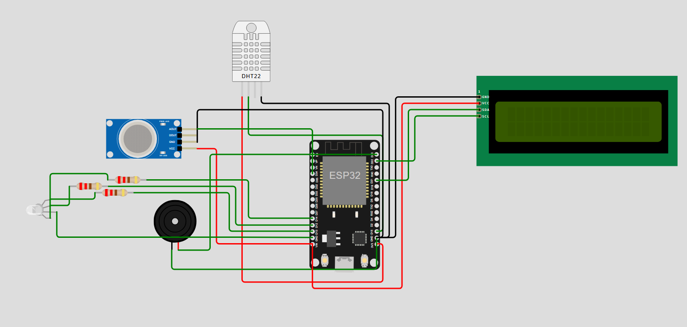
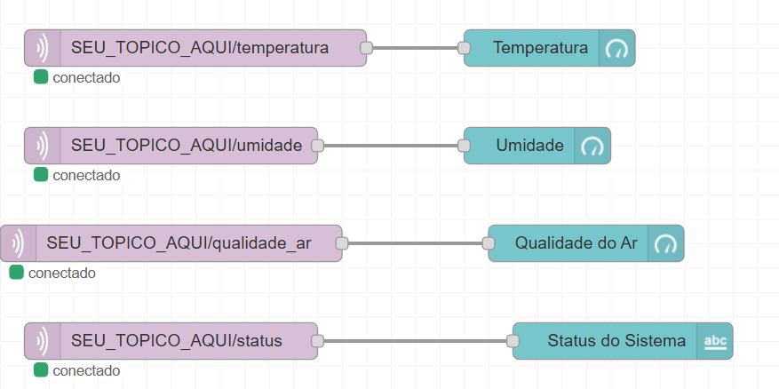

# AirGuard IoT

Sistema IoT de monitoramento ambiental desenvolvido com **ESP32**, **MicroPython**, **MQTT**, **HiveMQ**, **Wokwi** e **Node-RED**.

O AirGuard realiza a leitura de **temperatura, umidade e qualidade do ar**, processa essas informações localmente no ESP32 e classifica as condições do ambiente em diferentes níveis de status.

Os dados coletados são transmitidos através do protocolo MQTT e disponibilizados em um dashboard desenvolvido no Node-RED.

---

## 📌 Sobre o projeto

O **AirGuard IoT** foi desenvolvido como uma solução de monitoramento ambiental dentro de um cenário de **Internet das Coisas (IoT) e Smart Cities**.

O sistema utiliza um ESP32 executando MicroPython para realizar a leitura de sensores ambientais. Os dados são processados pelo próprio dispositivo e utilizados para determinar o estado atual do ambiente.

Além do processamento local, o sistema possui uma interface física composta por:

- Display LCD 16x2;
- LED RGB;
- Buzzer.

As informações também são enviadas através de uma conexão Wi-Fi para um broker MQTT, permitindo que o **Node-RED** receba os dados e os apresente em um dashboard.

---

## 🎯 Objetivo

Desenvolver um sistema IoT capaz de:

- coletar dados ambientais;
- processar as informações no microcontrolador;
- indicar localmente as condições do ambiente;
- transmitir os dados através de MQTT;
- disponibilizar as informações em uma interface de monitoramento.

---

## ⚙️ Funcionalidades

- 🌡️ Monitoramento de temperatura
- 💧 Monitoramento de umidade
- 🌫️ Monitoramento da qualidade do ar
- 🚦 Classificação das condições do ambiente
- 📟 Exibição das informações em LCD 16x2
- 💡 Indicação visual através de LED RGB
- 🔊 Alerta sonoro para situações críticas
- 📡 Conexão do ESP32 à rede Wi-Fi
- 📨 Comunicação utilizando o protocolo MQTT
- ☁️ Utilização do broker HiveMQ
- 📊 Visualização dos dados através do Node-RED
- 🧪 Simulação do hardware utilizando Wokwi

---

## 🛠️ Tecnologias utilizadas

| Tecnologia | Utilização |
|---|---|
| **ESP32** | Microcontrolador principal |
| **MicroPython** | Desenvolvimento do software embarcado |
| **Wokwi** | Simulação do circuito |
| **DHT22** | Medição de temperatura e umidade |
| **Sensor de gás** | Leitura utilizada para estimar a qualidade do ar |
| **LCD 16x2** | Exibição local das informações |
| **I2C** | Comunicação entre ESP32 e LCD |
| **LED RGB** | Indicação visual do status |
| **Buzzer** | Alerta sonoro |
| **Wi-Fi** | Comunicação de rede |
| **MQTT** | Protocolo de comunicação |
| **HiveMQ** | Broker MQTT |
| **Node-RED** | Recepção e visualização dos dados |

---

# 🏗️ Arquitetura do sistema

A arquitetura do AirGuard pode ser representada da seguinte forma:

```text
                    ┌─────────────────────┐
                    │        ESP32        │
                    │     MicroPython     │
                    └──────────┬──────────┘
                               │
                ┌──────────────┼──────────────┐
                │              │              │
                ▼              ▼              ▼
             DHT22        Sensor de gás    Interface
                │              │             local
                │              │        ┌────┼────┐
                │              │        │    │    │
                │              │       LCD  LED  Buzzer
                │              │        │    │    │
                └──────────────┴────────┴────┴────┘
                               │
                               ▼
                             Wi-Fi
                               │
                               ▼
                       ┌────────────────┐
                       │ MQTT / HiveMQ  │
                       └───────┬────────┘
                               │
                               ▼
                       ┌────────────────┐
                       │    Node-RED    │
                       └───────┬────────┘
                               │
                               ▼
                          Dashboard
```

### Fluxo de funcionamento

```text
Sensores
   ↓
ESP32
   ↓
Leitura dos dados
   ↓
Processamento
   ↓
Classificação do ambiente
   ↓
┌───────────────┬─────────────────┐
│               │                 │
▼               ▼                 ▼
LCD          LED/Buzzer        MQTT
                                  ↓
                               HiveMQ
                                  ↓
                              Node-RED
                                  ↓
                              Dashboard
```

---

# 🔌 Hardware

O circuito utilizado na simulação é composto pelos seguintes componentes:

- **ESP32 DevKit V1**
- **DHT22**
- **Sensor de gás**
- **LED RGB**
- **3 resistores de 220 Ω**
- **Buzzer**
- **LCD 16x2 com interface I2C**

## Conexões principais

| Componente | GPIO |
|---|---:|
| DHT22 | GPIO 15 |
| Sensor de gás | GPIO 34 |
| LED vermelho | GPIO 14 |
| LED verde | GPIO 12 |
| LED azul | GPIO 13 |
| Buzzer | GPIO 23 |
| LCD SDA | GPIO 21 |
| LCD SCL | GPIO 22 |

O circuito completo utilizado na simulação está disponível em:

```text
wokwi/diagram.json
```

---

# 🧪 Simulação com Wokwi

O projeto foi desenvolvido e simulado utilizando o **Wokwi**.

O arquivo:

```text
wokwi/diagram.json
```

contém a configuração do circuito, incluindo os componentes e suas conexões.

A simulação permite testar o comportamento do ESP32, dos sensores e dos dispositivos de saída sem a necessidade do hardware físico.

## Circuito



---

# 📟 Interface LCD

O AirGuard utiliza um display **LCD 16x2 com comunicação I2C** para apresentar as informações diretamente no dispositivo.

O sistema alterna entre duas telas.

### Tela 1 — Temperatura e umidade

```text
Temp: XX.XC
Umid: XX.X%
```

### Tela 2 — Qualidade do ar e status

```text
Ar: XXXX ppm
Status:AR BOM
```

O projeto também possui um **driver próprio para o LCD 16x2**, implementado diretamente no código MicroPython.

---

# 🚦 Classificação do ambiente

O ESP32 processa as leituras dos sensores e determina o status do ambiente.

O sistema possui três estados:

| Status | Indicador |
|---|---|
| **AR BOM** | LED verde |
| **ATENÇÃO** | LED amarelo |
| **CRÍTICO** | LED vermelho + buzzer |

A classificação é determinada pela combinação dos valores de **qualidade do ar** e **temperatura**.

### AR BOM

Quando:

```text
PPM < 1400
e
Temperatura < 30 °C
```

O sistema apresenta o status:

```text
AR BOM
```

e ativa o LED verde.

### ATENÇÃO

Quando:

```text
PPM < 3000
e
Temperatura < 35 °C
```

O sistema apresenta:

```text
ATENCAO
```

e ativa simultaneamente os LEDs vermelho e verde.

### CRÍTICO

Quando as condições anteriores não são atendidas, o sistema entra no estado:

```text
CRITICO
```

Nesse estado:

- o LED vermelho é ativado;
- o buzzer é acionado.

---

# 📡 Comunicação MQTT

A comunicação entre o ESP32 e o sistema de monitoramento é realizada utilizando o protocolo **MQTT**.

O ESP32 publica os dados coletados em tópicos separados.

```text
temperatura
umidade
qualidade_ar
status
```

Os tópicos são utilizados pelo Node-RED para receber e apresentar as informações no dashboard.

## Fluxo MQTT

```text
                         MQTT
                          │
             ┌────────────┼────────────┐
             │            │            │
             ▼            ▼            ▼
        Temperatura     Umidade    Qualidade do Ar
             │            │            │
             └────────────┼────────────┘
                          │
                          ▼
                        Status
                          │
                          ▼
                       Node-RED
```

---

# 🖥️ Node-RED

O Node-RED é utilizado para receber as mensagens MQTT e apresentar os dados em uma interface de monitoramento.

O dashboard possui quatro elementos principais:

- **Temperatura**
- **Umidade**
- **Qualidade do Ar**
- **Status do Sistema**

O fluxo utiliza o broker:

```text
broker.hivemq.com
```

através da porta:

```text
1883
```

O fluxo completo pode ser encontrado em:

```text
node-red/flow.json
```

## Fluxo do Node-RED



---

# 📊 Dashboard

O dashboard apresenta os dados enviados pelo ESP32 em tempo real através dos tópicos MQTT.

### Informações apresentadas

```text
┌─────────────────────────────┐
│        AirGuard             │
├─────────────────────────────┤
│                             │
│      Temperatura            │
│         XX °C               │
│                             │
│        Umidade              │
│          XX %               │
│                             │
│     Qualidade do Ar         │
│        XXXX ppm             │
│                             │
│     Status do Sistema       │
│        AR BOM               │
│                             │
└─────────────────────────────┘
```

---

# 🧠 Processamento dos dados

O processamento das informações ocorre diretamente no ESP32.

O dispositivo:

1. realiza a leitura do DHT22;
2. obtém temperatura e umidade;
3. realiza a leitura analógica do sensor de gás;
4. converte a leitura para uma estimativa em PPM;
5. determina o status do ambiente;
6. atualiza os dispositivos de saída;
7. publica os dados através do MQTT.

O ciclo é repetido continuamente.

```text
Leitura
   ↓
Processamento
   ↓
Classificação
   ↓
Interface local
   ↓
Publicação MQTT
   ↓
Aguardar
   ↓
Nova leitura
```

---

# 📁 Estrutura do projeto

```text
airguard-iot/
│
├── README.md
│
├── src/
│   └── main.py
│
├── wokwi/
│   └── diagram.json
│
├── node-red/
│   └── flow.json
│
└── docs/
    ├── circuito.png
    └── node-red.png
```

### `src/`

Contém o código principal desenvolvido em MicroPython.

```text
src/main.py
```

### `wokwi/`

Contém a configuração do circuito utilizado na simulação.

```text
wokwi/diagram.json
```

### `node-red/`

Contém o fluxo exportado do Node-RED.

```text
node-red/flow.json
```

### `docs/`

Contém imagens utilizadas na documentação do projeto.

---

# ▶️ Como executar

## 1. Executar a simulação

Abra o projeto no **Wokwi** e utilize o arquivo:

```text
wokwi/diagram.json
```

O código principal está localizado em:

```text
src/main.py
```

Execute o programa no ESP32 através do ambiente MicroPython.

---

## 2. Configurar o Node-RED

Abra o Node-RED e importe:

```text
node-red/flow.json
```

Após importar o fluxo, verifique a configuração do broker MQTT.

O projeto utiliza:

```text
Broker: broker.hivemq.com
Porta: 1883
```

Depois de realizar a configuração, faça o **Deploy** do fluxo.

---

## 3. Executar o sistema

Ao iniciar o ESP32, o sistema realiza a seguinte sequência:

```text
ESP32 iniciado
      ↓
Conexão Wi-Fi
      ↓
Conexão com MQTT
      ↓
Leitura dos sensores
      ↓
Classificação do ambiente
      ↓
Atualização do LCD
      ↓
Atualização dos LEDs/Buzzer
      ↓
Publicação MQTT
      ↓
Node-RED
      ↓
Dashboard
```

---

# 🔄 Ciclo de monitoramento

O sistema realiza uma nova leitura dos sensores periodicamente.

A cada ciclo são obtidos:

```text
Temperatura
Umidade
Qualidade do ar
Status
```

Esses dados são utilizados tanto pela interface local quanto pelo dashboard.

---

# 📚 Conceitos utilizados

O desenvolvimento do AirGuard envolve diferentes conceitos de computação e sistemas embarcados:

- Programação em MicroPython
- Programação de microcontroladores
- Leitura de sensores
- Conversão de sinais analógicos
- Comunicação I2C
- Comunicação Wi-Fi
- Protocolo MQTT
- Integração com broker MQTT
- Interface de hardware
- Processamento de dados
- Automação baseada em condições
- Internet das Coisas (IoT)
- Simulação de hardware
- Integração com Node-RED

---

# 🎓 Contexto acadêmico

O projeto foi desenvolvido no contexto acadêmico de **Internet das Coisas (IoT) e Smart Cities** para a disciplina de **Fundamentos de Sistemas Ciberfísicos**, utilizando uma arquitetura baseada em sensores, microcontrolador, comunicação sem fio e visualização de dados.

O objetivo foi integrar diferentes tecnologias em uma solução capaz de realizar monitoramento ambiental e disponibilizar os dados coletados para acompanhamento.

---

# 👨‍💻 Autores

**Davi Sequinel Pereira**
**Kaique Buchoski**

Estudantes de Ciência da Computação.

---

# 📄 Licença

Este projeto foi desenvolvido para fins acadêmicos e de portfólio.